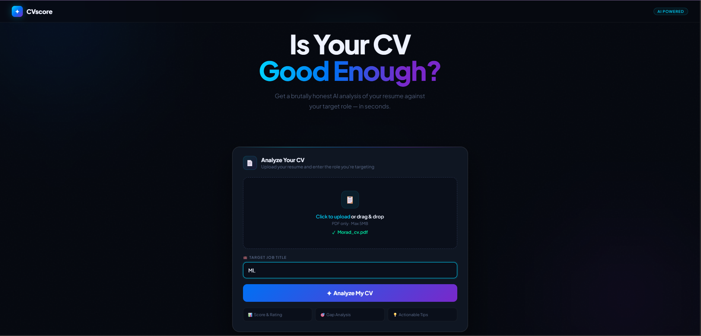
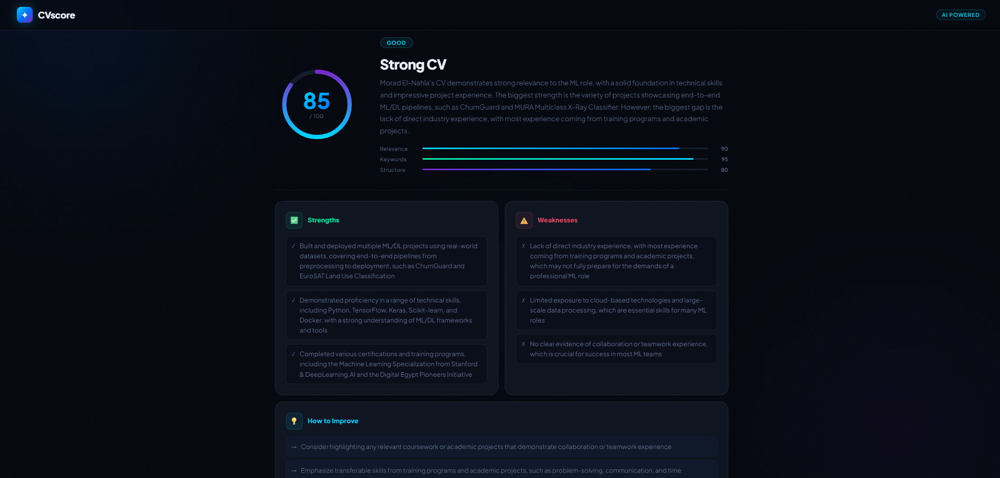

<div align="center">

# ✦ CVscore
### AI-Powered Resume Analyzer

**Upload your CV → Pick your target role → Get brutally honest AI feedback in seconds.**



[](https://python.org)
[](https://fastapi.tiangolo.com)
[](https://groq.com)
[](https://docker.com)

</div>

---

## 🤔 What is CVscore?

CVscore is an AI tool that evaluates your CV against a specific job title and returns a full detailed report — no sign-up, no fluff, just results.

---

## ✨ Features

- 🎯 **AI Score (0–100)** — Overall rating vs your target role
- 📊 **Relevance / Keywords / Structure** — Three sub-scores with animated bars
- 💪 **Strengths & Weaknesses** — Specific feedback referenced from your actual CV
- 💡 **How to Improve** — Concrete, actionable suggestions
- 🔍 **Missing Keywords** — What the role expects that you're missing
- 🏆 **Verdict** — Excellent / Good / Needs Work / Poor

---

## 🛠️ Tech Stack

| Layer | Tech |
|---|---|
| 🔧 Backend | FastAPI (Python) |
| 🧠 AI Engine | Groq API — LLaMA 3.3 70B |
| 📄 PDF Parsing | PyMuPDF |
| 🎨 Frontend | HTML / CSS / JS |
| 🐳 Deployment | Docker + Hugging Face Spaces |

---

## 📁 Project Structure

```
cv-analyzer/
├── main.py                 # FastAPI backend + Groq integration
├── templates/
│   └── index.html          # Full frontend UI
├── requirements.txt        # Python dependencies
├── Dockerfile              # Container config for HF Spaces
└── docker-compose.yml      # Local Docker setup
```

---

## 🚀 Run Locally

### Option 1 — Python

```bash
pip install -r requirements.txt
python main.py
```

Open → [http://localhost:8000](http://localhost:8000)

### Option 2 — Docker

```bash
docker-compose up --build
```

Open → [http://localhost:8000](http://localhost:8000)

---

## 🔑 Get a Free Groq API Key

1. Go to [console.groq.com](https://console.groq.com)
2. Sign up → **API Keys** → **Create API Key**
3. Paste it in `main.py`:

```python
GROQ_API_KEY = os.getenv("GROQ_API_KEY")
```

> ✅ Groq free tier = **14,400 requests/day**

---

## ⚙️ How It Works

```
📄 User uploads PDF
        ↓
🔍 PyMuPDF extracts text
        ↓
🚀 FastAPI sends text + job title to Groq
        ↓
🧠 LLaMA 3.3 70B returns structured JSON
        ↓
🎨 Frontend renders score, bars & feedback
```

---

## ☁️ Deploy to Hugging Face Spaces

1. Create a new Space → SDK: **Docker**
2. Push this repo
3. Add `GROQ_API_KEY` as a Space secret in Settings

> ✅ `Dockerfile` already exposes port `7860` as required by HF Spaces

---

## 📸 Screenshots




---

<div align="center">

By Morad Elnahla🔥

⭐ Star the repo if you found it useful

</div>
